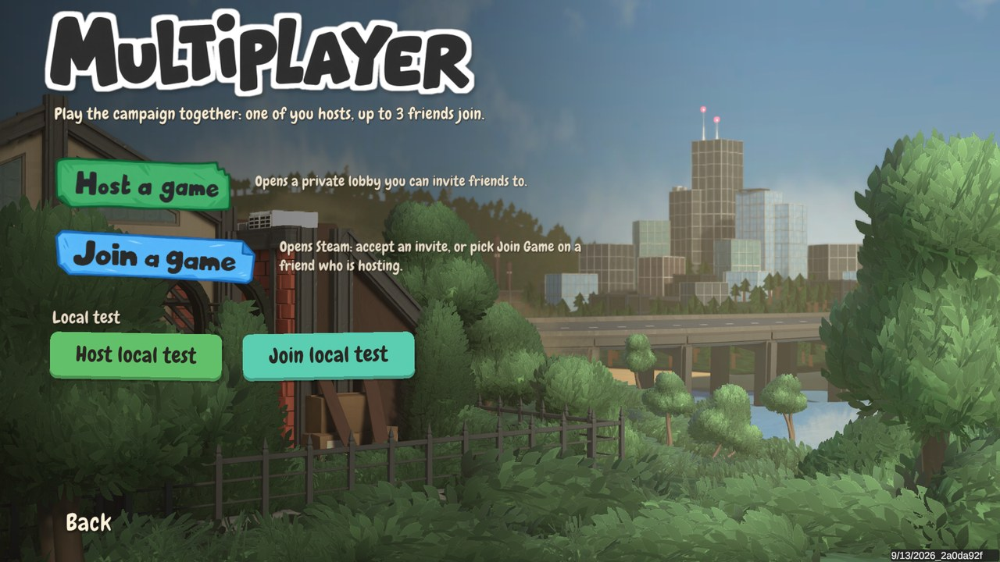

# Working on Co-Washers

Co-Washers is a BepInEx 5 plugin (C#, `netstandard2.1`). The host's game is in charge. Guests send what they do
(poses, tool hits, interactions) to the host. The host checks each request (distance, rate, whether the tool is
unlocked), applies it, and passes the results on. Everything goes through Steam lobbies and Steam's relay, so nobody
needs a server.

| Folder | What's in it |
|---|---|
| `DragNWashCoop/` | The plugin: sources, menu art and font (`Assets/`), `local-test.sh`, `package.py` |
| `DragNWashCoop.Tests/` | Tests for the packet format and the local test connection |
| `avatar/` | Turns the KoboldKare model into `kobold_avatar.bin`, the kobold other players see |
| `koboldkare/` | KoboldKare's kobold model and textures (CC0), which `avatar/` works from |
| `docs/` | Screenshots for the README |

## Building

You need the .NET SDK and a copy of the game with BepInEx installed. The project finds both in the default Steam
folder. If yours is somewhere else, pass `-p:GameDir=<game folder>`. From the repository root:

```sh
dotnet run --project DragNWashCoop.Tests/DragNWashCoop.Tests.csproj -c Release   # tests
dotnet build DragNWashCoop/DragNWashCoop.csproj -c Release -o DragNWashCoop/build
```

Then copy `DragNWashCoop/build/DragNWashCoop.dll` to `BepInEx/plugins/DragNWashCoop/` in the game folder.

Players can only connect when their DLLs are byte-for-byte identical, because the handshake compares a hash of the
file. So every release needs to be one build that everyone downloads.

## Making a release

1. Bump the version in `CoopPlugin.cs` (`BepInPlugin`; `package.py` reads it from there) and add the changes to
   `CHANGELOG.md`.
   If the packet format changed, bump `Envelope.Version` in `Protocol.cs` too.
2. Build, then run `python DragNWashCoop/package.py`. It writes `DragNWashCoop/artifacts/Co-Washers-<version>.zip`
   with the DLL, the licenses, the README and a `SHA256.txt`.
3. Upload that zip to a GitHub release. Don't commit it. Build output is ignored on purpose.

## Testing on one PC

For development only. Two or more copies of the game on the same PC connect over
`127.0.0.1` instead of Steam, each with a made-up player ID ("Local player 12345").
Steam and the lobby are not used, so a two-account playtest is still needed for the
Steam path.

- Quick start (Linux): run `DragNWashCoop/local-test.sh`. It starts two
  copies; the first hosts, the second joins, and both open the co-op menu.
  Press **Ready up** in the guest window, then pick a save sticker in the host window.
  Both render at 1080p (two copies at 4K ran an 8 GB graphics card out of memory; set
  `WIDTH`/`HEIGHT` to change it). Both are windows; under Hyprland the script floats them
  side by side on the widest monitor, since Hyprland tiles windows to any size (a 4K
  tile renders at 4K).
- By hand: start copies from the game folder with
  `./run_bepinex.sh ./DragNWash -screen-fullscreen 0 -coop-local-host > /dev/null 2>&1 &`
  (or `-coop-local-join`, or `-coop-local` to just show the buttons). Keep the output
  away from the terminal: in some terminals (e.g. kitty) BepInEx fails to start and the
  game runs without mods, leaving a `preloader_*.log` in the game folder. Or set
  `[Local test] Enabled = true` in `BepInEx/config/trixiescience.dragnwashcoop.cfg` to get
  **Host local test** / **Join local test** in the co-op menu. Steam only starts one copy
  from the library, so start the others this way.
- Every copy writes the same `LogOutput.log`, so in local test mode each copy also
  writes its own: `BepInEx/LogOutput.local-host.log`, `LogOutput.local-guest.log`, or
  `LogOutput.local-pid<process id>.log` when started without a role.
- Local test mode keeps the game running while its window is not focused.
- The port is `47713` (`[Local test] Port`) and only accepts connections from this PC.
- Developer options (with `-coop-local`): `-coop-menu-shot <png>` screenshots the main menu
  and quits; add `-coop-shot-ui` to open the co-op menu first (a `-coop-local-host` copy then
  waits for its guest to ready up). `-coop-local-ready` makes a `-coop-local-join` copy ready
  up by itself (otherwise press **Ready up**). `-coop-local-autostart <slot>` makes a host start the
  campaign from that save slot once its guests are ready. Mind that the host plays and saves
  that slot.
- More developer options, for checking the other players' kobold:
  - `-coop-dev-walk`: the pose this copy sends walks in a circle and looks around.
  - `-coop-dev-run`: like `-coop-dev-walk`, but moving the way a real player does, at the game's 5 m/s: running,
    stopping dead, flicking the camera round, strafing both ways and backing up.
  - `-coop-dev-tool <name>`: this copy holds that tool (e.g. `Sprayer` or `Sponge`) and uses it while the walk
    stands still.
  - `-coop-dev-yip`: yips once per walk cycle.
  - `-coop-avatar-shot <dir>`: photographs the other player's kobold from a separate camera, plus its first tool
    use and first yip. Add `-coop-shot-quit` to quit afterwards.
  - `-coop-avatar-trace <file.csv>`: records 30 s of the other player's kobold, every frame (feet, hips, head, and
    the snapshot buffer).



## The kobold

The other players' kobold is KoboldKare's model. `avatar/prepare_textures.py` makes its texture SFW, and
`avatar/export_avatar.py` exports it from Blender:

```sh
python avatar/prepare_textures.py
blender -b koboldkare/kobold_import.blend --python avatar/export_avatar.py
cp avatar/kobold_avatar.bin DragNWashCoop/Assets/   # the DLL embeds this copy
```

It's animated entirely in code (`KoboldAvatar.cs`, `AvatarMotion.cs`). KoboldKare's animation clips come from
Mixamo and aren't CC0, so they're kept out of the repository and never used.

## Other mods

If a `RyanEatsEgg` plugin is installed, Co-Washers pauses it during co-op sessions, since its animations would only
play on one screen.

## Bug reports

The most useful things to have are `BepInEx/LogOutput.log` from both players, the game's Steam build ID, the
SHA-256 of both DLLs, the level and dragon, and what went different between the two screens.
