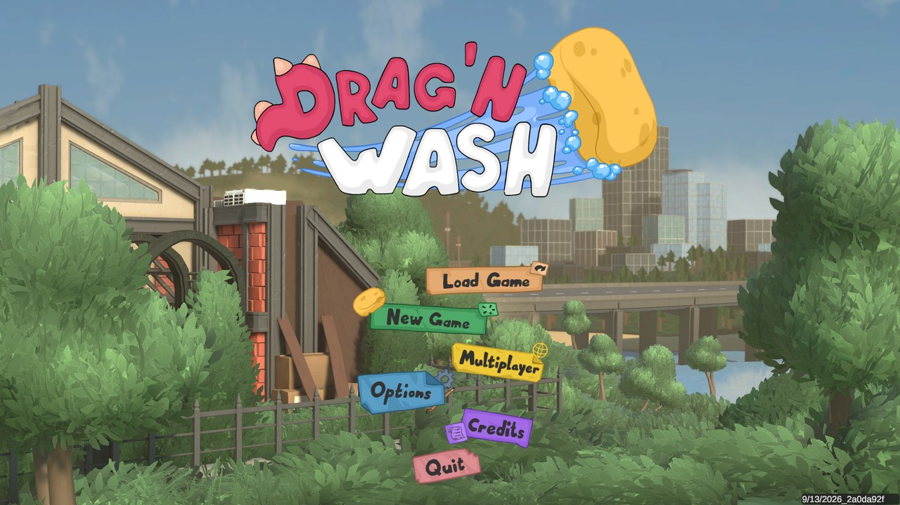
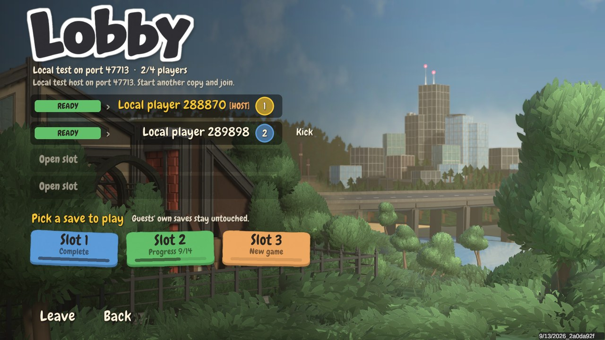

# Co-Washers

Online co-op for Drag'n Wash. One of you hosts, up to three friends join, and you wash through the campaign
together over Steam.

Everyone else shows up as a kobold that moves the way they actually play: it looks where they look, walks where
they walk and holds the tool they're holding. Everyone gets their own colour, and you can press **Y** to yip at
each other. Ryan reacts to everyone's sponge and spray, the story moves everyone along together, and friends can
drop into a wash that's already going.

Drag'n Wash is an adult game, and this mod is for adults too.

> **Status:** beta. It's been played on Linux. The Windows version loads it fine and can host a lobby (checked
> through Proton), but nobody has played on actual Windows yet. If you do, please say how it went.

## What you need

- Drag'n Wash on Steam, with Steam running. Nobody needs to port forward, because Steam handles the connection.
- [BepInEx 5](https://github.com/BepInEx/BepInEx/releases) (5.4.23 or a newer 5.x, not 6).
- Everyone on the same version of the game and the same Co-Washers release. The mod checks this and won't let
  mismatched copies connect.

## Installing

### Windows

1. Download `BepInEx_win_x64_5.4.x.zip` and unzip it into the game folder, next to `DragNWash.exe`.
   (In Steam: right-click Drag'n Wash → Manage → Browse local files.)
2. Start the game once and quit, so BepInEx can set itself up.
3. Download the latest Co-Washers zip from [Releases](../../releases) and unzip it into the game folder too.
   It only contains a `BepInEx` folder, which goes on top of the one that's already there.

### Linux (the native build)

1. Download `BepInEx_linux_x64_5.4.x.zip` and unzip it into the game folder.
2. Open `run_bepinex.sh` in a text editor and set `executable_name="DragNWash"`.
3. In Steam, go to Drag'n Wash → Properties → Launch Options and enter `./run_bepinex.sh %command%`.
4. Start the game once and quit, then unzip the Co-Washers release into the game folder.

If it worked, the main menu has a **Multiplayer** button.

## Playing

**Hosting:** press **Multiplayer** (or **F7**) and choose **Host a game**. Invite people with **Invite
friends** or by clicking an open slot. Anyone on your Steam friends list can also just pick **Join Game** on you.
Once everyone's ready, pick the save you want to play.

**Joining:** accept the invite, or find the host in your Steam friends list and pick **Join Game**. Then press
**F7** and **Ready up**.

| Key | What it does |
|---|---|
| F7 | Opens the co-op menu. During a wash, **Your tools** gets you your own copy of any tool that's unlocked. |
| Y | Yip! |

### Good to know

- The game uses the host's save. Guests' saves are never touched.
- The host makes the story choices. During scripted scenes, guests watch the host's scene and get control back
  afterwards.
- If the host leaves, the session ends and everyone goes back to the main menu. There's no host migration.
- There's no voice chat, so use Discord or Steam.
- There's no macOS support.

## If something's wrong

- **"Game build or co-op mod version differs from host"** or **"The host did not answer":** someone has a
  different game update or a different Co-Washers release. Update everyone to the latest.
- **No Multiplayer button:** BepInEx isn't loading. Check that `BepInEx/LogOutput.log` exists in the game folder.
  On Windows, antivirus sometimes deletes BepInEx's `winhttp.dll`, so make sure it's still next to
  `DragNWash.exe`. On Linux, check the launch option.
- **Continue and Load Game are missing:** Steam isn't running. The game can't find its saves without it.

Found a bug? [Open an issue](../../issues) and attach `BepInEx/LogOutput.log` from both the host and the guest,
plus what you were doing when it went wrong. The logs contain Steam names, so check them before posting if that
bothers you.

## Credits

- Name by Cinderace.
- The kobold is from [KoboldKare](https://github.com/naelstrof/KoboldKare) by naelstrof, released as CC0.
- The menu font is [Chewy](https://fonts.google.com/specimen/Chewy) by Sideshow, under the Apache License 2.0.

Co-Washers is made by TrixieScience and released under the [MIT License](LICENSE). Anyone who wants to build it
or work on it can start with [DEVELOPING.md](DEVELOPING.md), and past changes are in the
[changelog](CHANGELOG.md).
